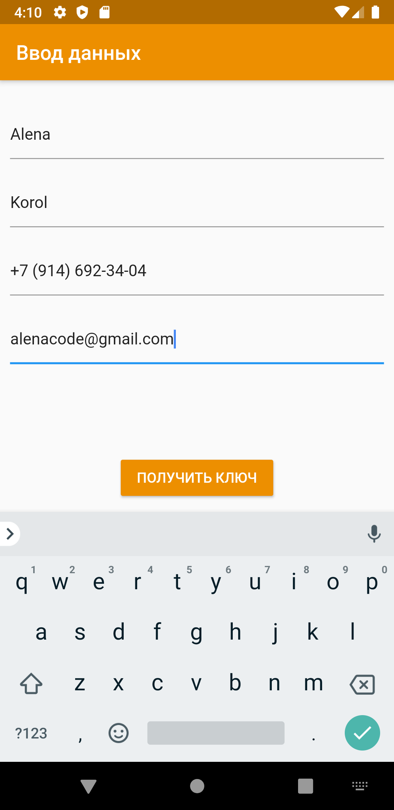
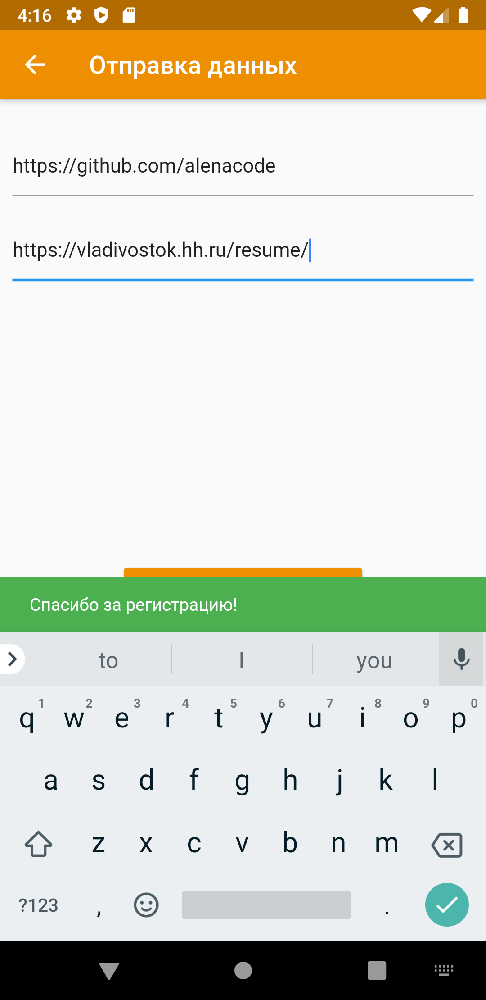

# PREVIEW

При запуске пользователь попадает на экран с формой ввода личных данных. На данном
шаге нужно ввести фамилию, имя, отчество, e-mail, телефон.
Далее по кнопке "ПОЛУЧИТЬ КЛЮЧ", приложение запрашивает токен через API, используя
введенные ранее данные.
После получения токена нужно перейти к форме для регистрации. Где пользователь
указывает ссылки на резюме и на репозиторий github с исходным кодом данного задания. После
чего отправляет токен, ссылки и контактные данные через второй метод API.

  
  

